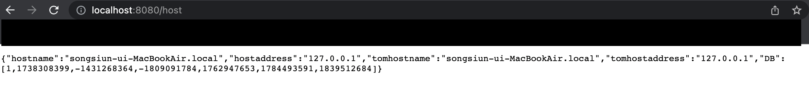

# Application 개발

- ### Application 구조


- ### 개발 환경
  - Spring Boot - 2.6
  - Java 11
  - PostgreSQL


- ### 주요 기능
  - Demo(Spring Boot #1)
    - Spring Boot #2 한테 데이터 받아오기
      ```java
          public HashMap gethost(){
              URI url = UriComponentsBuilder
              .fromUriString("http://local:8081")
              .path("/host")
              .build().toUri();
    
              RestTemplate restTemplate = new RestTemplate();
              ResponseEntity<HashMap> responseEntity = restTemplate.getForEntity(url, HashMap.class);
              return responseEntity.getBody();
          }
      ```
    - 브라우저한테 받아온 데이터와 호스트네임 보내기
      ```java
          @GetMapping(value = "/host")
          public HashMap<String, Object> printhost(){
              HashMap response = gethost();
              HashMap<String, Object> map = new HashMap<>();
              try {
                  String hostname = InetAddress.getLocalHost().getHostName();
                  String hostadd = InetAddress.getLocalHost().getHostAddress();
                  map.put("hostname", hostname);
                  map.put("hostaddress", hostadd);
                  map.putAll(response);
              } catch (UnknownHostException e) {
                  e.printStackTrace();
              }
    
              return map;
          }
      ```
  - Demo2(Spring Boot #2)
    - 접속시 DB(PostgreSQL) INSERT
       ```java
       public void insert() {
               Random random = new Random();
               random.setSeed(System.currentTimeMillis());
    
               String sql = "insert into test values(?)";
               int res = jdbcTemplate.update(sql, random.nextInt());
           }
       ```
    - 접속시 DB(PostgreSQL) SELECT
      ```java
      public List<Integer> find() throws SQLException {
          List<Integer> res = jdbcTemplate.query("select * from test", rowMapper());
          return res;
          }
      ```
    - demo(Spring Boot #1)에게 전송
      ```java
      @GetMapping(value = "/host")
          public HashMap<String, Object> printhost() {
              HashMap<String, Object> map = new HashMap<>();
              try {
                  String hostname = InetAddress.getLocalHost().getHostName();
                  String hostadd = InetAddress.getLocalHost().getHostAddress();
                  map.put("tomhostname", hostname);
                  map.put("tomhostaddress", hostadd);
              } catch (UnknownHostException e) {
                  e.printStackTrace();
              }
    
              DBrepo dBrepo = new DBrepo(dataSource);
              dBrepo.insert();
              List<Integer> lst = null;
              try {
                  lst = dBrepo.find();
              } catch (SQLException e) {
                  e.printStackTrace();
              }
              map.put("DB", lst);
              return map;
          }
      ```
    - Springboot PostgreSQL연동
      ```properties
          server.port=8081
          spring.datasource.driver-class-name=org.postgresql.Driver
          spring.datasource.url=jdbc:postgresql://localhost:5432/test
          spring.datasource.username=woons
          spring.datasource.password=
      ```
    
- Local환경에서 테스트 결과
