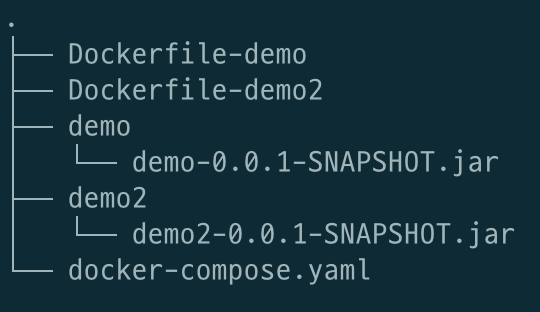
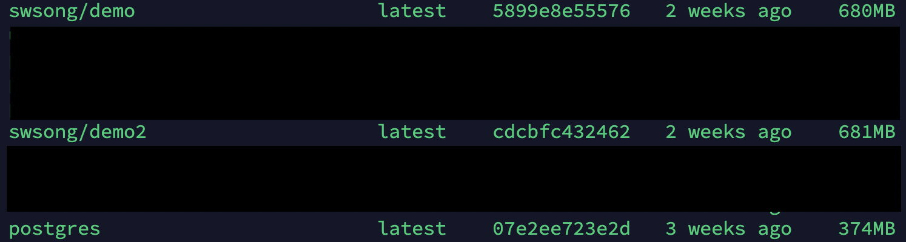
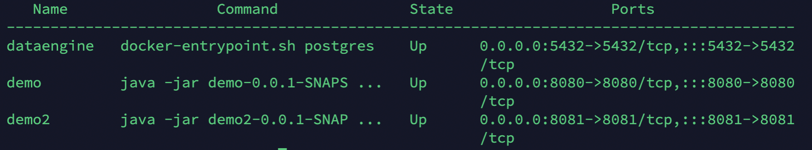
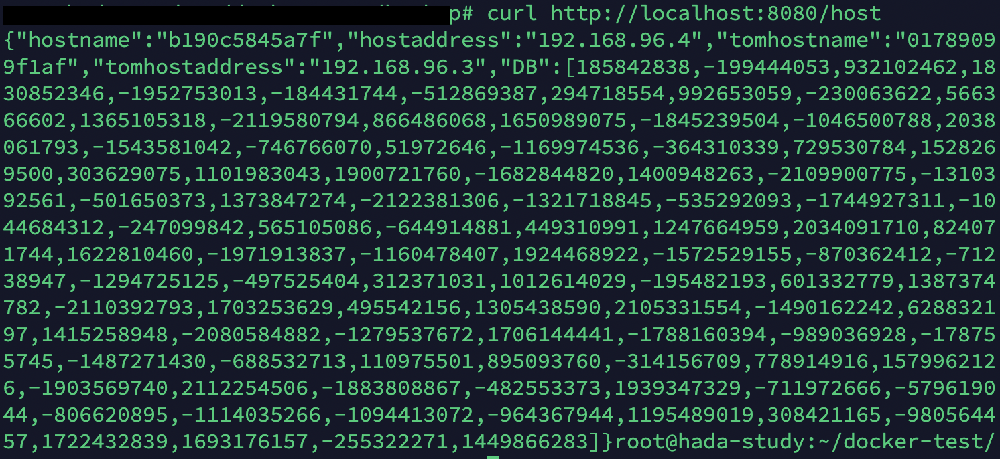
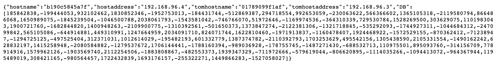

# Docker

- [이전 실습](../Application/README.md)에서 Local환경에서 App을 실행시켰을 때 브라우저에서 원하는 값이 잘 뜨는 것을 확인하였다.
- 이번에는 저번에 만들어놓은 Application을 모두 docker-compose을 이용하여 컨테이너 환경에서 실행시켜 볼 것이다.

### 실습환경
- OS: Ubuntu 20.04
- Docker: 20.10.12
- docker-compose: 1.29.2

### [1. Application 배포 파일 만들기](#1.-Application-배포-파일-만들기)
### [2. Dockerfile 작성](#2.-Dockerfile-작성)
### [3. docker-compose.yaml 작성](#3.-docker_compose.yaml-작성)
### [4. docker-compose.yaml 실행](#4.-docker_compose.yaml-실행)


---
### 1. Application 배포 파일 만들기
  - Application을 배포하기전 docker-compose에서 컨테이너끼리 통신에서는 서비스 이름이 호스트네임으로 사용된다.
  - 따라서 기존에 localhost환경에서 테스트했던 코드를 살짝 수정이 필요 하다.
  - Spring Boot에서는 tomcat이 내장 서버로 있기 때문에 따로 WAS 설치필요 없이 jar파일로 배포
---
  - **demo**
    ```java
    public HashMap gethost(){
        URI url = UriComponentsBuilder
        .fromUriString("http://demo2:8081") // 기존코드 "http://localhost:8081"
        .path("/host")
        .build().toUri();
  
        RestTemplate restTemplate = new RestTemplate();
        ResponseEntity<HashMap> responseEntity = restTemplate.getForEntity(url, HashMap.class);     
        return responseEntity.getBody();
        }
    ```
    - localhost가 아닌 다른 컨테이너네임인 `demo2`를 호스트네임으로 사용해주어야한다.

  - demo2
    ```properties
    server.port=8081
    spring.datasource.driver-class-name=org.postgresql.Driver
    spring.datasource.url=jdbc:postgresql://dataengine:5432/postgres  -> dataengine: DB 컨테이너 네임
    spring.datasource.username=postgres
    spring.datasource.password=postgres
    ```
  

### 2. Dockerfile 작성
- Dockerfile은 이미지를 만들때 필요한 패키지 및 환경 변수 설정들의 순서 및 방법이 적혀있는 파일
- 디렉토리 구조
    
  - Dockerfile, docker-compose.yaml은 root 디렉토리에 있어야 하며 Application은 각 딕렉토리 안에 넣어두는 것을 선호한다.
- **demo**
    ```dockerfile
    FROM openjdk:11-jdk
    COPY demo/* /opt
    WORKDIR /opt
    EXPOSE 8080
    ENTRYPOINT ["java","-jar","demo-0.0.1-SNAPSHOT.jar"]
    ```
    - `FROM`: 일반적으로 Docker Hub에서 Base 이미지를 불러오는 명령어 -> Base 이미지 위에 자신이 원하는 것을 쌓아올림
      - demo, demo2는 jar파일로 배포했기 때문에 개발시 사용한 java11버전을 base 이미지로 한다.  
    - `COPY`: Host에 있는 파일을 컨테이너로 복사하는 명령어 -> demo 디렉토리안에 demo jar파일이 있음
    - `WORKDIR`: 무언가를 실행시키는 명령어(`RUN`, `CMD`, `ENTRYPOINT`)를 실행시킬 디렉토리 설정 -> 앞서 jar파일을 넣어둔 /opt에서 실행
    - `EXPOSE`: 컨테이너의 Port 번호 설정 -> 컨테이너 내부에서만 유효, host에서 접근 X
    - `ENTRYPOINT`:  컨테이너에서 최종단계에서 실행시키는 명령어 선언 -> demo jar파일을 실행해야됨
- **demo2**
    ```dockerfile
    FROM openjdk:11-jdk
    COPY demo2/* /opt
    WORKDIR /opt
    EXPOSE 8081
    ENTRYPOINT ["java","-jar","demo2-0.0.1-SNAPSHOT.jar"]
    ```
    - demo와 배포 파일명, 포트 번호를 제외하고 모두 동일
- **PostgreSQL**
    - PostgreSQL을 데이터베이스로 사용하는데 단순히 Docker Hub에서 이미지를 가져오면 되기 때문에 Dockerfile 불필요 -> docker-compose.yaml에서 작 
  
### 3. docker_compose.yaml 작성
- docker compose는 다중 컨테이너를 순서대로 자동으로 실행시켜주고 관리해주는 툴이다.
- **docker-compose.yaml**
    ```yaml
    version: '3'
    
    services:
      demo:
        build:
          context: .
          dockerfile: Dockerfile-demo
        image: swsong/demo
        container_name: demo
        depends_on:
          - demo2
        ports:
          - "8080:8080"
    
      demo2:
        build:
          context: .
          dockerfile: Dockerfile-demo2
        image: swsong/demo2
        restart: always
        container_name: demo2
        depends_on:
          - dataengine
        ports:
          - "8081:8081"
    
      dataengine:
        image: postgres:latest
        container_name: dataengine
        restart: always
        ports:
          - "5432:5432"
        environment:
          POSTGRES_USER: "postgres"
          POSTGRES_PASSWORD: "postgres"
        volumes:
          - /root/docker-test/data:/var/lib/postgresql/data
    
    ```
  - `services`: Application단위를 의미한다 예를 들어 demo, demo2, DB 각각 services가 된다.
    - `build`: Dockerfile을 이용하여 이미질르 만든 후 컨테이너를 생성
      - `context`: Dockerfile 위치
      - `dockerfile`: Dockerfile 이름
    - `image`: 이미지 생성시 위치와 이름
    - `depends_on`: 선행 되어야 하는 service
    - `ports`: 호스트 포트 : 컨테이너 포트
    - `restart`: `always`는 수동으로 끄기 전까지 항상 재시작

### 4. docker_compose.yaml 실행
- `Dockerfile` 및 `docker-compose.yaml` 파일이 있는 디렉토리에서 실행
```shell
$ docker-compose build --force-rm
$ docker images
```
- `docker-compose build --force-rm`: 이미지를 생성 (같은 이름인 이미지가 있으면 삭제후 생성)
- `docker images`로 생성된 이미지 확인
    
```shell
$ docker-compose up -d
$ docker-compose ps

$ docker-compose down
```
- `docker-compose.yaml`을 이용하여 컨테이너 생성 `-d` 백그라운드 옵션을 안주면 새로운 창을 켜야 되므로 백그라운드로 실행
- `docker-compose ps` 현재 실행중인 컨테이너 확인
    
- `docker-compose down` 올라가 있는 컨테이너를 모두 내림

### 5. 실행 결과
- host에서 `curl`을 이용하여 접속시 에러없이 출력 확인
    
- 브라우저를 통해 접속
  
    - local 환경에서 테스트 할 때는 호스트 네임과 ip가 같았지만 컨테이너는 새로운 Ip를 받기 때문에 다른 것을 알수있다.
